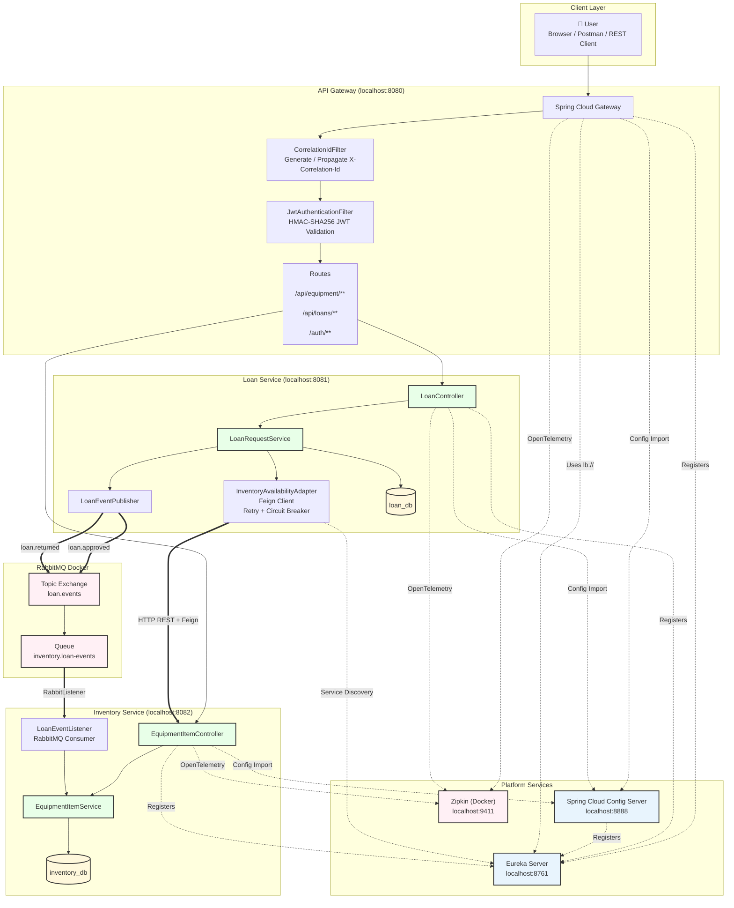
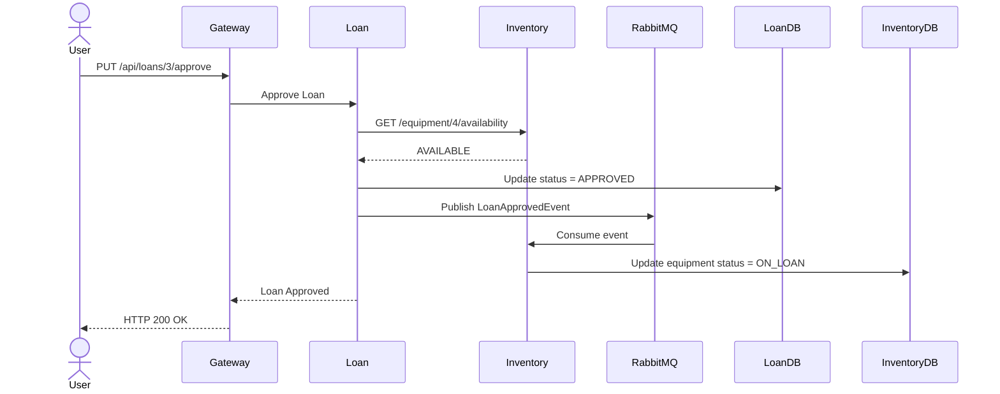
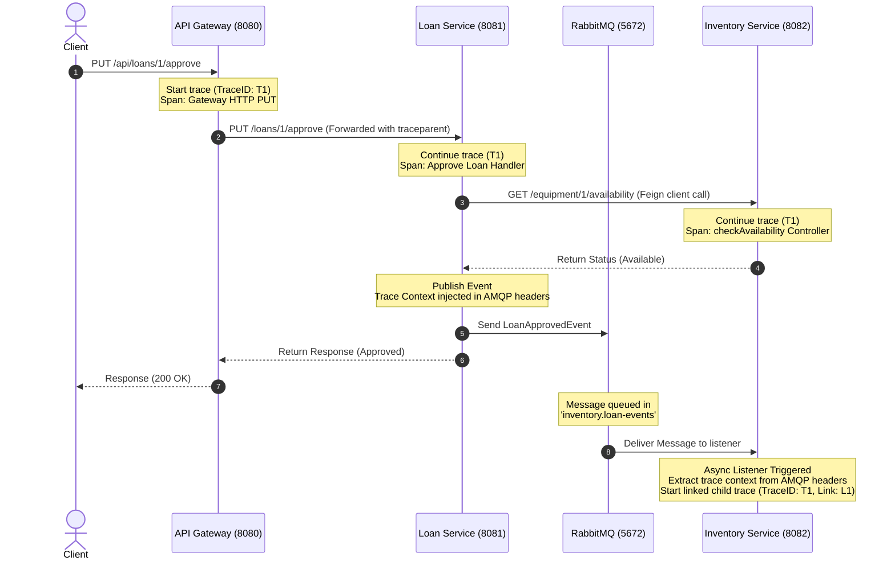

# Emergency Equipment Lending Platform

> **Microservices Architecture Assignment — Autumn 2026**  
> Eureka · Config Server · API Gateway · OpenFeign + Resilience4J · RabbitMQ events · JWT · OpenTelemetry/Zipkin

[]()
[]()
[]()
[]()

---

## Domain Rationale

The **Emergency Equipment Lending Platform** was selected as the application domain because it produces a genuine architectural constraint that academic domains rarely expose:

> Equipment **availability** must be checked **synchronously** before approval (the answer determines the decision). Equipment **status updates** can propagate **asynchronously** (they are committed side-effects that must not block the approval response).

This constraint creates a natural and justifiable boundary between:
- **OpenFeign (synchronous):** `GET /equipment/{id}/availability` — cannot be deferred; outcome determines the loan decision in the same HTTP request.
- **RabbitMQ (asynchronous):** `loan.approved` / `loan.returned` events — the loan is already committed; the status update is a side-effect.

The domain differs materially from prior group work and from generic academic examples (hotels, retail, banking).

**Two domain microservices:**

| Service | Role | Database | Port |
| :--- | :--- | :--- | :--- |
| **loan-service** (Service A) | Loan request lifecycle (`PENDING → APPROVED → RETURNED`); Feign caller; RabbitMQ producer | `loan_db.loan_requests` | 8081 |
| **inventory-service** (Service B) | Equipment catalogue CRUD; Feign target; RabbitMQ consumer | `inventory_db.equipment_items` | 8082 |

---

## Project Description

The **Emergency Equipment Lending Platform** is a microservices-based system that manages the lending of emergency equipment (defibrillators, stretchers, oxygen cylinders, etc.) to authorised borrowers. It is composed of two domain microservices and three platform infrastructure services:

| Module | Role |
|--------|------|
| **loan-service** (Service A) | Owns the full loan-request lifecycle: `PENDING → APPROVED → RETURNED`. Before approving a loan it calls inventory-service synchronously via OpenFeign to confirm the equipment is available. |
| **inventory-service** (Service B) | Owns the equipment catalogue. Exposes CRUD endpoints and a dedicated `/equipment/{id}/availability` endpoint consumed by loan-service. |
| **eureka-server** | Service registry — all services register here; loan-service resolves `lb://inventory-service` through it. |
| **config-server** | Centralised config server (native filesystem backend). Serves per-service, per-profile YAML from `config-repo/`. |
| **api-gateway** | Single reactive Spring Cloud Gateway entry point on port 8080. Routes `/api/loans/**` → loan-service and `/api/equipment/**` → inventory-service. Adds `X-Correlation-Id` to every request. |

---

## Architecture Diagram


## Loan Approval Sequence

### Communication flows

| Flow | Protocol | Direction |
|------|----------|-----------|
| Client → all services | REST/HTTP via Gateway | Synchronous |
| Loan Service → Inventory Service | OpenFeign (HTTP, Resilience4J retry + circuit-breaker) | Synchronous |
| Loan Service → Inventory Service (status update) | RabbitMQ topic exchange `loan.events` | Asynchronous |
| All services → Zipkin | OTel `ZipkinSpanExporter` (HTTP) | Background |
| All services → Eureka | HTTP heartbeat | Background |
| All services → Config Server | HTTP on startup | Once at start |

## Confirmed Environment

| Tool | Required |
|------|---------|
| JDK | 25.0.3 ( `java -version` to check) |
| Maven | 3.9.11 ( `mvn -version` ) |
| OS | Windows 10/11 or any POSIX shell (WSL / Git Bash) |
| Spring Boot | **4.1.0** (confirmed stable on start.spring.io, June 2026) |
| Spring Cloud | **2025.1.2** (confirmed compatible with Boot 4.1.0, June 2026) |
|Resilience4j | **2.4.0**|
| MySQL | 8.0 |
| RabbitMQ | 3.1 (management image) |
| Zipkin | latest (`openzipkin/zipkin`) |
| Docker | For RabbitMQ, and Zipkin locally |

>

---

## One-Time Setup

### 1. Clone the Repository

```bash
git clone https://github.com/VinayReddy072/Microservices_Platform.git
cd Microservices_Platform
```

### 2. Start MySQL 8.0


**Native MySQL install:**

1. Download MySQL 8.0 Community Server from https://dev.mysql.com/downloads/mysql/
2. Run the installer.
3. Start the MySQL service: `net start MySQL80` (Windows)

### 3. MySQL Workbench Connection (for report evidence)

1. Open **MySQL Workbench** → click "MySQL Connections".
2. Fill in the form:
   - **Connection Name**: `EmergencyEquipment`
   - **Port**: `3306`
   - **Username**: `root`
3. Click **Test Connection** → should show "Successfully made the MySQL connection".
4. Click **OK** to save.

> **Using Workbench as report evidence:** After running the Day 3 CRUD commands below, open the `EmergencyEquipment` connection in Workbench, navigate to `loan_db` → `Tables` → `loan_requests` → right-click → *Select Rows*. This gives you a visual table view to screenshot for the report.

### 4. Create Databases and Users

Connect to MySQL (open Workbench → SQL Editor) and run:

```sql
-- Loan service database and user
CREATE DATABASE IF NOT EXISTS loan_db
  CHARACTER SET utf8mb4 COLLATE utf8mb4_unicode_ci;
CREATE USER IF NOT EXISTS 'loan_user'@'%' IDENTIFIED BY 'loan_pass';
GRANT ALL PRIVILEGES ON loan_db.* TO 'loan_user'@'%';

-- Inventory service database and user
CREATE DATABASE IF NOT EXISTS inventory_db
  CHARACTER SET utf8mb4 COLLATE utf8mb4_unicode_ci;
CREATE USER IF NOT EXISTS 'inventory_user'@'%' IDENTIFIED BY 'inventory_pass';
GRANT ALL PRIVILEGES ON inventory_db.* TO 'inventory_user'@'%';

FLUSH PRIVILEGES;

-- Verify
SHOW DATABASES;
SELECT User, Host FROM mysql.user WHERE User IN ('loan_user','inventory_user');
```

### 5. Export Environment Variables (per shell session)

**Windows PowerShell:**

Use an HTTP client (Postman/Insomnia/Git Bash with manual commands) to perform the verification flow:

1. Source environment variables in your shell:

  source .env

2. Obtain an ADMIN JWT:

  - POST to `http://localhost:8080/auth/login` with JSON body `{ "username": "admin", "password": "adminpass" }`.
  - Extract the `token` field from the response and store it as `ADMIN_TOKEN` in your client or shell.

3. Create equipment via the gateway (Inventory):

  - POST to `http://localhost:8080/api/equipment` with `Authorization: Bearer <ADMIN_TOKEN>` and a JSON body describing the equipment (e.g., `name`, `category`, `location`, `conditionNotes`).

4. Create a loan via the gateway (Loan):

  - POST to `http://localhost:8080/api/loans` with `Authorization: Bearer <ADMIN_TOKEN>` and a JSON body `{ "equipmentItemId": <id>, "borrowerName": "...", "borrowerContact": "..." }`.

5. Approve the loan (triggers Feign availability check and publishes an AMQP event):

  - PUT `http://localhost:8080/api/loans/{id}/approve` with `Authorization: Bearer <ADMIN_TOKEN>`.

After each step, inspect the HTTP response in your client, review service logs, and verify the database state in MySQL Workbench.

From the project root, compile and install all 5 modules:

```bash
cd "C:.....\Microservices_Platform"
mvn clean install -DskipTests
```

Expected output (no errors):
```
[INFO] Building Emergency Equipment Lending Platform — Parent
[INFO] Building Emergency Equipment Lending — Eureka Server        BUILD SUCCESS
[INFO] Building Emergency Equipment Lending — Config Server        BUILD SUCCESS
[INFO] Building Emergency Equipment Lending — API Gateway          BUILD SUCCESS
[INFO] Building Emergency Equipment Lending — Loan Service         BUILD SUCCESS
[INFO] Building Emergency Equipment Lending — Inventory Service    BUILD SUCCESS
[INFO] BUILD SUCCESS
```

> **Spring Boot 4.1.0 breaking changes already applied in this project** (for reference):
> - `spring-boot-starter-aspectj` in Spring Boot 4.1.0
> - `resilience4j-spring-boot4` (v2.4.0) for Boot 4.1.0
> - **Lombok** requires an explicit `<annotationProcessorPaths>` entry in `maven-compiler-plugin` with JDK 17+ relying on `<optional>true</optional>` alone no longer works
> - All three fixes are already applied in [pom.xml](pom.xml). If you add a new module, copy the `maven-compiler-plugin` block from the parent.

> **IDE null analysis popup** - If your IDE asks *"Null annotation types detected — enable null analysis?"*, click **No**. This is triggered by JSR-305 annotations inside Spring/Lombok JARs.

---

## Running Order

> **Order:** Eureka must be up before any client tries to register. Config Server must be up before domain services pull their config on startup. Gateway can only route to services that have already registered.

```
1. Zipkin          → http://localhost:9411   (Docker)
2. MySQL           → port 3306            
3. RabbitMQ        → http://localhost:15672  (Docker)
4. eureka-server   → http://localhost:8761
5. config-server   → http://localhost:8888
6. inventory-service → http://localhost:8082
7. loan-service    → http://localhost:8081
8. api-gateway     → http://localhost:8080
```

Start each service in a separate Git Bash terminal. Before starting each service, source the shared `.env` file so all required environment variables (database credentials, RabbitMQ configuration, JWT secret, etc.) are available.

```bash
# Terminal 1 — Eureka Server
cd ~/Desktop/Microservices_Platform
source .env
cd platform/eureka-server
mvn spring-boot:run

# Terminal 2 — Config Server
cd ~/Desktop/Microservices_Platform
source .env
cd platform/config-server
mvn spring-boot:run

# Terminal 3 — Inventory Service
cd ~/Desktop/Microservices_Platform
source .env
cd services/inventory-service
mvn spring-boot:run

# Terminal 4 — Loan Service
cd ~/Desktop/Microservices_Platform
source .env
cd services/loan-service
mvn spring-boot:run

# Terminal 5 — API Gateway
cd ~/Desktop/Microservices_Platform
source .env
cd platform/api-gateway
mvn spring-boot:run
```

Alternatively, build the project first (source the environment variables before starting each one):

```bash
cd ~/Desktop/Microservices_Platform
source .env
mvn clean package -DskipTests

# Terminal 1
cd ~/Desktop/Microservices_Platform
source .env
java -jar platform/eureka-server/target/eureka-server-1.0.0-SNAPSHOT.jar

# Terminal 2
cd ~/Desktop/Microservices_Platform
source .env
java -jar platform/config-server/target/config-server-1.0.0-SNAPSHOT.jar

# Terminal 3
cd ~/Desktop/Microservices_Platform
source .env
java -jar services/inventory-service/target/inventory-service-1.0.0-SNAPSHOT.jar

# Terminal 4
cd ~/Desktop/Microservices_Platform
source .env
java -jar services/loan-service/target/loan-service-1.0.0-SNAPSHOT.jar

# Terminal 5
cd ~/Desktop/Microservices_Platform
source .env
java -jar platform/api-gateway/target/api-gateway-1.0.0-SNAPSHOT.jar
```

**Why `source .env`?**

The `.env` file centralizes sensitive and environment-specific configuration, including:

- `LOAN_DB_URL`, `LOAN_DB_USER`, `LOAN_DB_PASS`
- `INVENTORY_DB_URL`, `INVENTORY_DB_USER`, `INVENTORY_DB_PASS`
- `CONFIG_REPO_PATH`
- `RABBITMQ_HOST`, `RABBITMQ_USER`, `RABBITMQ_PASSWORD`
- `JWT_SECRET`

Sourcing the file before starting each service ensures these values are available as environment variables without hardcoding secrets into the application configuration, supporting the project's externalized configuration strategy.

---

## 1. Skeleton + Eureka Server

- Confirm `mvn clean install -DskipTests` passes from the project root.
- Start `eureka-server` and verify the dashboard.

### Commands & Verification

Commands:

1. Build the project from the repository root:

  mvn clean install -DskipTests

2. Start the Eureka server (from its module directory):

  cd platform/eureka-server
  mvn spring-boot:run

Verification:

- Open http://localhost:8761 in a browser to view the Eureka dashboard. Initially it will show no registered instances.
- Capture a screenshot of the Eureka dashboard for the report.

---

## 2. Config Server

- Start config-server (Eureka must already be running).
- Verify config-server registers with Eureka.
- Confirm property files are served correctly.

### Commands & Verification

Commands:

1. Start the Config Server (ensure Eureka is up):

   cd platform/config-server
   mvn spring-boot:run

Verification (no `curl` required):

- In a browser or API client (Postman/Insomnia), open the config endpoints:
  - http://localhost:8888/application/default
  - http://localhost:8888/loan-service/dev
  - http://localhost:8888/inventory-service/production
- Confirm the responses contain a `propertySources` array with the expected YAML values (datasource URL, `ddl-auto`, logging levels).
- Capture screenshots of the config response and the Config Server entry in Eureka for documentation.

---

## 3. Domain Service CRUD

- Start `inventory-service` and `loan-service` (Eureka + Config Server must be running).
- Exercise every CRUD endpoint on both services.
- Use MySQL Workbench to visually inspect the `loan_requests` and `equipment_items` tables after each write operation.

### Inventory Service- Port 8082

Instructions (use a REST client or API tool instead of inline `curl`):

1. Access the Inventory API at http://localhost:8082/equipment.

2. Create an equipment item by sending a POST request with a JSON body containing `name`, `category`, `location`, and `conditionNotes`.

3. Retrieve all equipment with a GET request to `/equipment` and a single item with GET `/equipment/{id}`.

4. Check availability (used by `loan-service`) via GET `/equipment/{id}/availability`.

5. Update an item with PUT `/equipment/{id}` including the full JSON representation.

6. Trigger validation failures intentionally (e.g., empty `name`) to observe HTTP 400 field-level error responses.

7. Delete items with DELETE `/equipment/{id}`.

Verification / Observability:

- Use Postman/Insomnia or your preferred HTTP client to perform the requests and inspect responses.
- Confirm the `equipment_items` table in MySQL Workbench is updated after each write.
- Capture screenshots of API responses and the DB table for the report.

### Loan Service- Port 8081

Instructions (use a REST client or API tool instead of inline `curl`):

1. Access the Loan API at http://localhost:8081/loans.

2. Create a loan by POSTing JSON with `equipmentItemId`, `borrowerName`, and `borrowerContact`.

3. List loans with GET `/loans` or retrieve a single loan with GET `/loans/{id}`.

4. Approve a loan with PUT `/loans/{id}/approve`. Approval performs a synchronous availability check against `inventory-service`.

5. Return a loan with PUT `/loans/{id}/return` which publishes a return event.

6. Test validation scenarios by submitting requests with missing/invalid fields to observe HTTP 400 field-level responses.

Verification / Observability:

- Confirm POST responses return HTTP 201 and include the generated `id` in the response body.
- For non-existent resources, confirm the API returns HTTP 404 with an explanatory message.
- Inspect the `loan_requests` table in MySQL Workbench to verify writes and state transitions. Include screenshots in the report.

---

## 4. API Gateway Routing & Discovery

- Start `api-gateway` (all other services must be running).
- Verify all requests routed through the gateway work correctly.

### Gateway- Port 8080

Instructions:

1. Start the API Gateway after the domain services and infrastructure are running:

   cd platform/api-gateway
   mvn spring-boot:run

2. Use a REST client to send requests via the gateway at http://localhost:8080:

   - Inventory: `/api/equipment` (GET, POST, PUT, DELETE)
   - Loans: `/api/loans` (GET, POST), `/api/loans/{id}/approve` (PUT), `/api/loans/{id}/return` (PUT)

3. Verify headers and routing:

   - Confirm `X-Correlation-Id` is present in responses (use browser dev tools or an HTTP client to inspect headers).
   - Confirm routes are forwarded to the domain services (Eureka will show registered instances).

4. Capture gateway logs demonstrating route forwarding and correlation-id propagation for the report.

> **Note on port exposure:** During development and demonstration, domain service ports 8081 and 8082 are left open locally so you can test direct access vs. gateway access and kill a service mid-demo. In a real deployment, these ports would be firewalled/network-restricted (e.g., within a private VPC or Kubernetes pod network) so the API Gateway on port 8080 is the **sole externally reachable entry point**. This distinction should be noted explicitly in the project report.

---

## 5. Feign Client + Resilience4J

- Verify the Feign + Resilience4J stack when approving a loan.
- Test the circuit-breaker fallback by stopping inventory-service.

### Test resilience patterns

Instructions:

1. Normal approval path:

  - Create a loan and approve it using the loan service endpoints via an HTTP client. Approval triggers the Feign availability check to `inventory-service`.

2. To test failure handling:

  - Stop `inventory-service`, then create and attempt to approve a loan. Observe `loan-service` logs for retry attempts and the fallback warning.

3. Check circuit-breaker state using the actuator endpoint (open in a browser or API client):

  - http://localhost:8081/actuator/circuitbreakers

4. After restarting `inventory-service`, monitor the actuator endpoint or logs to confirm the circuit transitions from OPEN → HALF_OPEN → CLOSED.

5. Capture log excerpts showing retry attempts and the fallback warning for inclusion in the report.

---

## 6. RabbitMQ Async Event Flow

- Start RabbitMQ, approve a loan, confirm the equipment status flips via the message broker without any direct REST call.

### Start RabbitMQ

Start RabbitMQ (Docker):

1. Launch RabbitMQ with the management UI:

   docker run -d --name eelp-rabbitmq -p 5672:5672 -p 15672:15672 rabbitmq:management

2. Open http://localhost:15672 and log in with `guest` / `guest` to inspect exchanges and queues.

Event flow verification (use an HTTP client rather than inline `curl`):

- Create equipment via POST `/equipment` on the inventory service.
- Create a loan via POST `/loans` on the loan service.
- Verify equipment status before approval by GET `/equipment/{id}`.
- Approve the loan with PUT `/loans/{id}/approve` on the loan service; this publishes a `loan.approved` event to `loan.events`.
- Observe the `inventory.loan-events` queue processing and confirm `equipment_items.status` changed to `ON_LOAN` in MySQL Workbench.
- To return, PUT `/loans/{id}/return` and confirm the status reverts to `AVAILABLE` after the listener processes the `loan.returned` event.

Capture screenshots of the RabbitMQ Exchanges/Bindings, queue message counts, inventory-service logs showing `LoanEventListener`, and the DB before/after state.

---

## 7. JWT Security

- Set `JWT_SECRET`, start the gateway, confirm token-based access control.

### Generate and export JWT_SECRET

The gateway refuses to start without `JWT_SECRET`. Generate a 32-byte Base64 key:

```bash

# Git Bash / POSIX shells
export JWT_SECRET=$(openssl rand -base64 32)
```
Use an HTTP client to run the verification sequence (no inline `curl` required):

1. Source environment variables in your shell: source .env

2. Obtain an ADMIN JWT by POSTing JSON `{ "username": "admin", "password": "adminpass" }` to `/auth/login` and extract the `token` from the response.

3. Create equipment via the gateway by POSTing a JSON equipment object to `/api/equipment` with `Authorization: Bearer <ADMIN_TOKEN>`.

4. Create a loan by POSTing to `/api/loans` with `Authorization: Bearer <ADMIN_TOKEN>`.

5. Approve the loan with PUT `/api/loans/{id}/approve` using the same `Authorization` header; approval triggers the Feign availability check and publishes the async event to RabbitMQ.

After each request, inspect the HTTP response in your client, review service logs for trace identifiers, and verify the database state in MySQL Workbench.
| Username | Password   | Role  | Access |
|----------|------------|-------|--------|
| user     | password   | USER  | GET /api/** |
| admin    | adminpass  | ADMIN | all methods on /api/** |

---

## Distributed Tracing : OpenTelemetry + Zipkin

This module implements distributed tracing across all services in the Emergency Equipment Lending Platform. By integrating **OpenTelemetry (OTel)** via **Micrometer Tracing**, we track HTTP requests, Feign client calls and RabbitMQ message publish/subscribe flows under single correlated trace identifiers.

### 1. Tracing Flow Architecture



### Dependency Breakdown

The following tracing dependencies are integrated into all three service/gateway modules:

- `io.micrometer:micrometer-tracing-bridge-otel` : Bridges the Micrometer Observation/Tracing APIs to the OpenTelemetry SDK. Handles span creation, lifecycle, and context propagation. Managed by Spring Boot BOM at version 1.7.0.
- `io.opentelemetry:opentelemetry-exporter-zipkin` : Formats spans into Zipkin JSON v2 and sends them to the Zipkin collector. Managed by Spring Boot BOM at version 1.62.0.

Spring Boot 4.1 does not auto-configure the OTel bridge from `spring-boot-starter-actuator` alone. `TracingConfig.java` in each service manually wires `OpenTelemetrySdk` + `ZipkinSpanExporter` + `OtelTracer` and registers a `DefaultTracingObservationHandler`.


### 3. Centralized Configuration Details

In `config-repo/application.yml`, the following observability properties are configured:

```yaml
management:
  tracing:
    sampling:
      probability: 1.0       # Sample 100% of traces (essential for verification)
  zipkin:
    tracing:
      endpoint: http://localhost:9411/api/v2/spans # Zipkin collector endpoint

spring:
  rabbitmq:
    template:
      observation-enabled: true # Automatically create spans when publishing messages
    listener:
      simple:
        observation-enabled: true # Automatically extract context and create listener spans

logging:
  pattern:
    level: "%5p [${spring.application.name},%X{traceId:-},%X{spanId:-}]"
```

> **Log Pattern Integration:** By inserting `%X{traceId:-}` and `%X{spanId:-}`, Micrometer Tracing automatically pushes the current span's context into Logback/Log4j's MDC. Any log output produced during a request lifecycle will display the active `traceId` and `spanId` automatically.

### 4. Setting up Zipkin Infrastructure

Distributed trace spans are collected and visualized in **Zipkin**.

#### Run Zipkin via Docker
```bash
docker run -d --name eelp-zipkin -p 9411:9411 openzipkin/zipkin
```

*   **HTTP UI Port:** [http://localhost:9411](http://localhost:9411)
*   **Collector Endpoint:** `http://localhost:9411/api/v2/spans` (exposed for all microservices)

---

### Architectural Decision Records (ADRs)

Five ADRs are in `docs/adr/`, covering all required and recommended decisions:

| ADR | Title | 
|-----|-------|
| [001](docs/adr/001-gateway-centred-security.md) | Gateway-Centred Security (JWT, filter ordering, role rules, port-exposure tradeoff) | 
| [002](docs/adr/002-event-driven-communication.md) | Async RabbitMQ — exact exchange/queue/routing-key names; why side effect ≠ same-request answer | 
| [003](docs/adr/003-resilience-and-failure-handling.md) | Resilience stack (exact YAML values) + Distributed Tracing; honest async-trace finding | 
| [004](docs/adr/004-service-discovery-and-config.md) | Eureka Service Discovery + Spring Cloud Config (combined) | 
| [005](docs/adr/005-database-per-service.md) | Database per Service + cross-service access patterns (Feign vs RabbitMQ) | 

---

## Repository Structure

```
Microservices_Platform/
├── config-repo/                   # Config Server backend (multiple YAML files)
│   ├── application.yml            # Shared config (Eureka, RabbitMQ, tracing, sampling)
│   ├── loan-service-dev.yml
│   ├── loan-service-production.yml
│   ├── inventory-service-dev.yml
│   └── inventory-service-production.yml
├── docs/
│   ├── Report.md                  # report (technical + verification evidence)
│   ├── images/                    # Screenshots and verification artifacts
│   └── adr/                       # Architectural Decision Records
│       ├── 001-gateway-centred-security.md
│       ├── 002-event-driven-communication.md
│       ├── 003-resilience-and-failure-handling.md
│       ├── 004-service-discovery-and-config.md
│       └── 005-database-per-service.md
├── platform/
│   ├── eureka-server/
│   ├── config-server/
│   └── api-gateway/               # JWT filter, correlation-ID filter, routing
├── services/
│   ├── loan-service/              # CRUD + Feign client + Resilience4J + RabbitMQ publisher
│   └── inventory-service/         # CRUD + RabbitMQ consumer
├── .env                           # Local secrets (gitignored)
├── .gitignore
└── pom.xml                        # Multi-module parent
```

----
## Criterion:

| Criterion | Evidence |
|-----------------|----------------------------|
| Multi-service architecture (2+ domain services) | `loan-service` (port 8081) + `inventory-service` (port 8082) — separate Spring Boot apps, separate MySQL databases (`loan_db`, `inventory_db`), separate schemas |
| Service discovery (Eureka) | All services register with Eureka; `lb://` URIs used in Gateway routes and Feign client — no hardcoded IPs |
| Centralised config (Config Server) | Native filesystem backend; dev vs production profiles with meaningful differences (`ddl-auto: update` vs `validate`, `DEBUG` vs `INFO`); `${ENV_VAR:default}` placeholders for secrets |
| API Gateway as entry point | Explicit routes (not auto-discovery-locator); path rewrite (`/api/loans/**` → `/loans/**`); `CorrelationIdFilter` adds/propagates `X-Correlation-Id` on every request |
| Gateway is sole external entry point | Direct ports (8081, 8082) intentionally left open for local demo — report states these would be firewalled in production |
| Service-to-Service communication + Resilience | Four-layer resilience stack on `InventoryAvailabilityAdapter.checkAvailability()`: (1) Feign timeout config, (2) `@Retry` restricted to `IOException`/`RetryableException`, (3) `@CircuitBreaker` with configurable failure-rate threshold, (4) fallback that provisionally approves + logs warning |
| Domain-driven REST API (CRUD) | Full CRUD on both services; `@Valid` on POST; per-field `MethodArgumentNotValidException` handler (HTTP 400 field→message map); `EntityNotFoundException` → HTTP 404 |
| JWT Security | `JwtAuthenticationFilter` (WebFilter at `HIGHEST_PRECEDENCE+1`) validates Bearer tokens on every route except `/auth/login`. Role rules: USER → GET only on `/api/**`, ADMIN → all methods. `AuthController` at `POST /auth/login`. `JWT_SECRET` env var required (no default), so the gateway refuses to start without it. `X-Correlation-Id` is present even on 401/403 responses. |
| Async messaging (RabbitMQ) | Topic exchange `loan.events`; routing keys `loan.approved` and `loan.returned`. `LoanEventPublisher` publishes after DB save. `LoanEventListener` consumes events and updates `equipment_items.status`. `loan.approved` changes items to `ON_LOAN`; `loan.returned` changes items back to `AVAILABLE`. Verified using live data: loan **7** (`Trace Tester`, item **8**) transitioned to `RETURNED`, and `inventory_db.equipment_items` shows item **8 (Ultrasound Machine)** as `AVAILABLE` without any REST call or shared database access. |
| Distributed tracing (Zipkin/OpenTelemetry) | Tracing instrumentation added in the next phase. |
| Architecture Decision Records (ADRs) | `docs/` directory created. ADRs written. |

---
