# Emergency Equipment Lending Platform
## Technical Report - Microservices Architecture Assignment

| **Student Name** | Thalla Vinay Reddy |
| :--- | :--- |
| **Student ID** | 22FA081016 |
| **Module** | Microservices Architecture |
| **Repository** | `https://github.com/VinayReddy072/Microservices_Platform` |
| **Stack** | Spring Boot 4.1.0 · Spring Cloud 2025.1.2 · Java 25 · MySQL 8 · RabbitMQ 3 · OpenTelemetry + Zipkin |
| **Build** | `mvn clean install -DskipTests` → `BUILD SUCCESS` across all 6 modules |

---

## Table of Contents

1. [Application Overview](#1-application-overview)
2. [Architecture Overview](#2-architecture-overview)
3. [Implementation Evidence](#3-implementation-evidence)
   - [3.1 REST APIs](#31-rest-apis)
   - [3.2 Gateway and Service Discovery](#32-gateway-and-service-discovery)
   - [3.3 Configuration Management](#33-configuration-management)
   - [3.4 Security](#34-security)
   - [3.5 Service-to-Service Communication and Resilience](#35-service-to-service-communication-and-resilience)
   - [3.6 Asynchronous Messaging](#36-asynchronous-messaging)
   - [3.7 Observability and Distributed Tracing](#37-observability-and-distributed-tracing)
4. [Architecture Decision Records](#4-architecture-decision-records)
5. [Screencast Cross-Reference Table](#5-screencast-cross-reference-table)
6. [Repository and Build Evidence](#6-repository-and-build-evidence)

---

## 1. Application Overview

### 1.1 Problem Statement

Emergency medical services operate in high-stakes environments where the correct equipment: defibrillators, oxygen cylinders, resuscitation kits - must be allocated, dispatched, and returned in a timely and accountable manner. Manual logbooks and ad hoc tracking create risks of double-allocation (the same item issued to two responders simultaneously), lost equipment, and delayed responses when assets are urgently needed.

The **Emergency Equipment Lending Platform** automates the lifecycle of emergency medical asset allocation: from request submission and real-time availability checking, through approval or rejection, to equipment return. The system maintains an authoritative catalogue of equipment items and a tamper-evident record of every lending transaction.

### 1.2 Service Responsibilities

**loan-service (Port 8081 - Service A):**  
Manages the loan request lifecycle. Accepts new requests, performs a synchronous availability check against inventory-service before approving, enforces the state machine (`PENDING → APPROVED / REJECTED → RETURNED`), and publishes domain events to RabbitMQ after state transitions.

**inventory-service (Port 8082 - Service B):**  
Manages the equipment catalogue with full CRUD. Exposes a dedicated availability endpoint consumed synchronously by loan-service. Consumes RabbitMQ events to update equipment status asynchronously. Does not initiate calls to loan-service.

### 1.3 Entity Relationship

| Entity | Service | Table | Key Fields |
| :--- | :--- | :--- | :--- |
| `EquipmentItem` | inventory-service | `inventory_db.equipment_items` | `id`, `name`, `category`, `status` (AVAILABLE / ON_LOAN), `location`, `conditionNotes` |
| `LoanRequest` | loan-service | `loan_db.loan_requests` | `id`, `equipmentItemId` (logical ref), `borrowerName`, `borrowerContact`, `status` (PENDING / APPROVED / REJECTED / RETURNED), `requestedAt`, `approvedAt`, `returnedAt` |

`LoanRequest.equipmentItemId` is a logical reference — a plain integer. There is no JPA `@JoinColumn` crossing into `inventory_db`. All cross-service data access uses the REST API (Feign) or RabbitMQ events, never shared SQL.

### 1.4 Domain Originality

This domain was selected because it models a genuine architectural constraint absent from typical academic domains: equipment availability is a real-time property that must be checked synchronously at approval time (the result determines the decision), while the resulting status change is a committed side-effect that must not block the approval response. This creates a natural boundary between synchronous and asynchronous communication.

The domain differs from any prior group work, which typically involves hotel bookings, retail orders, or banking.

---

## 2. Architecture Overview

### 2.1 System Architecture Diagram

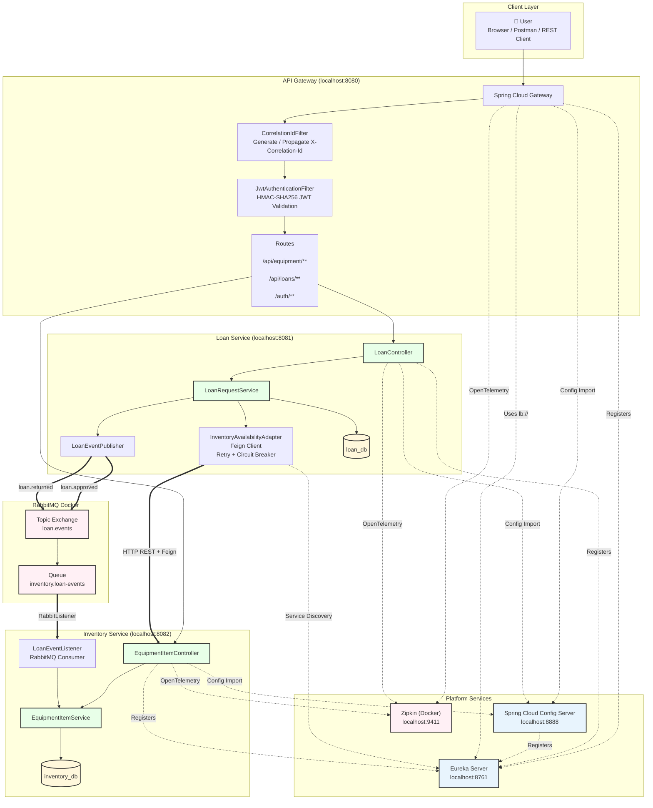
```mermaid
flowchart TB

subgraph CLIENT["Client Layer"]
    User["👤 User<br/>Browser / Postman / REST Client"]
end


subgraph GATEWAY["API Gateway (localhost:8080)"]

Gateway["Spring Cloud Gateway"]

Correlation["CorrelationIdFilter<br/>Generate / Propagate X-Correlation-Id"]

JWT["JwtAuthenticationFilter<br/>HMAC-SHA256 JWT Validation"]

Routes["Routes<br/>
/api/equipment/**<br/>
/api/loans/**<br/>
/auth/**"]

Gateway --> Correlation
Correlation --> JWT
JWT --> Routes

end


subgraph PLATFORM["Platform Services"]

Eureka["Eureka Server<br/>localhost:8761"]

Config["Spring Cloud Config Server<br/>localhost:8888"]

Zipkin["Zipkin (Docker)<br/>localhost:9411"]

end


subgraph LOAN["Loan Service (localhost:8081)"]

LoanController["LoanController"]

LoanService["LoanRequestService"]

Availability["InventoryAvailabilityAdapter<br/>Feign Client<br/>Retry + Circuit Breaker"]

Publisher["LoanEventPublisher"]

LoanDB[(loan_db)]

LoanController --> LoanService

LoanService --> Availability

LoanService --> Publisher

LoanService --> LoanDB

end

subgraph INVENTORY["Inventory Service (localhost:8082)"]

EquipmentController["EquipmentItemController"]

EquipmentService["EquipmentItemService"]

Listener["LoanEventListener<br/>RabbitMQ Consumer"]

InventoryDB[(inventory_db)]

EquipmentController --> EquipmentService

EquipmentService --> InventoryDB

Listener --> EquipmentService

end


subgraph MQ["RabbitMQ Docker"]

Exchange["Topic Exchange<br/>loan.events"]

Queue["Queue<br/>inventory.loan-events"]

Exchange --> Queue

end

User --> Gateway

Routes --> LoanController

Routes --> EquipmentController


Gateway -. Registers .-> Eureka

LoanController -. Registers .-> Eureka

EquipmentController -. Registers .-> Eureka

Config -. Registers .-> Eureka

Gateway -. Uses lb:// .-> Eureka

Availability -. Service Discovery .-> Eureka


Gateway -. Config Import .-> Config

LoanController -. Config Import .-> Config

EquipmentController -. Config Import .-> Config


Availability ==>|HTTP REST + Feign| EquipmentController


Publisher ==>|loan.approved| Exchange

Publisher ==>|loan.returned| Exchange

Queue ==>|RabbitListener| Listener


Gateway -. OpenTelemetry .-> Zipkin

LoanController -. OpenTelemetry .-> Zipkin

EquipmentController -. OpenTelemetry .-> Zipkin


classDef db fill:#FFF8DC,stroke:#333,stroke-width:2px;
classDef infra fill:#E8F4FD,stroke:#333,stroke-width:2px;
classDef service fill:#E8FFE8,stroke:#333,stroke-width:2px;
classDef docker fill:#FFF0F5,stroke:#333,stroke-width:2px;

class LoanDB,InventoryDB db;
class Eureka,Config infra;
class LoanController,EquipmentController,LoanService,EquipmentService service;
class Exchange,Queue,Zipkin docker;
```
## Loan Approval Sequence

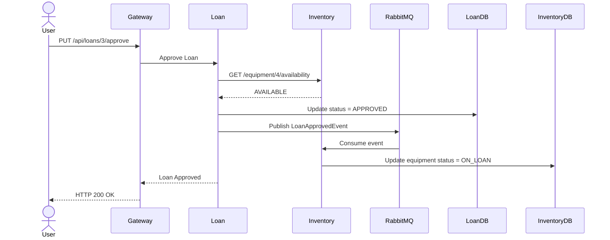
```mermaid
sequenceDiagram

actor User

participant Gateway

participant Loan

participant Inventory

participant RabbitMQ

participant LoanDB

participant InventoryDB

User->>Gateway: PUT /api/loans/3/approve

Gateway->>Loan: Approve Loan

Loan->>Inventory: GET /equipment/4/availability

Inventory-->>Loan: AVAILABLE

Loan->>LoanDB: Update status = APPROVED

Loan->>RabbitMQ: Publish LoanApprovedEvent

RabbitMQ->>Inventory: Consume event

Inventory->>InventoryDB: Update equipment status = ON_LOAN

Loan-->>Gateway: Loan Approved

Gateway-->>User: HTTP 200 OK
```

### 2.2 Component Responsibilities
| Component | Port | Responsibility |
| :--- | :--- | :--- |
| API Gateway | 8080 | Sole client entry point; JWT auth; CorrelationId filter; discovery-based routing |
| Eureka Server | 8761 | Service registry — all five processes register and resolve via `lb://` |
| Config Server | 8888 | Centralised YAML configuration; native filesystem backend; dev/production profiles |
| loan-service | 8081 | Loan lifecycle domain service; Feign caller; RabbitMQ producer |
| inventory-service | 8082 | Equipment catalogue; Feign target; RabbitMQ consumer |
| MySQL | 3306 | Two isolated schemas: `loan_db` (`loan_user`) and `inventory_db` (`inventory_user`) |
| RabbitMQ | 5672/15672 | Async event broker; `loan.events` exchange; `inventory.loan-events` queue |
| Zipkin | 9411 | Distributed trace aggregator — receives OTel spans from all three application services |

### 2.3 Communication Patterns

| Pattern | Path | Reason |
| :--- | :--- | :--- |
| Synchronous REST (OpenFeign) | loan-service → inventory-service | Availability result determines approval decision; cannot be deferred |
| Asynchronous Messaging (RabbitMQ) | loan-service → inventory-service | Status update is a committed side-effect; must not block approval response |

### 2.4 Build and Startup Verification

**Maven build output:**
```
[INFO] Building Emergency Equipment Lending Platform — Parent      1.0.0-SNAPSHOT
[INFO] Building Emergency Equipment Lending — Eureka Server        BUILD SUCCESS
[INFO] Building Emergency Equipment Lending — Config Server        BUILD SUCCESS
[INFO] Building Emergency Equipment Lending — API Gateway          BUILD SUCCESS
[INFO] Building Emergency Equipment Lending — Loan Service         BUILD SUCCESS
[INFO] Building Emergency Equipment Lending — Inventory Service    BUILD SUCCESS
[INFO] BUILD SUCCESS
```

**Startup order (dependency chain):**
```
1. docker start eelp-zipkin eelp-rabbitmq eelp-mysql
2. eureka-server       (8761) — must start first; all others register here
3. config-server       (8888) — must start before domain services
4. inventory-service   (8082) — declares RabbitMQ exchange/queue
5. loan-service        (8081)
6. api-gateway         (8080) — last; needs services registered in Eureka
```

**Eureka dashboard - all five registered UP:**

```
Application         AMIs  Availability Zones  Status
API-GATEWAY          n/a        1            UP (1) — :api-gateway:8080
CONFIG-SERVER        n/a        1            UP (1) — :config-server:8888
INVENTORY-SERVICE    n/a        1            UP (1) — :inventory-service:8082
LOAN-SERVICE         n/a        1            UP (1) — :loan-service:8081
EUREKA-SERVER        n/a        1            UP (1) — :eureka-server:8761
```


.png)

---

## 3. Implementation:

### 3.1 REST APIs

Both services implement full CRUD using standard HTTP semantics. Input validation uses Jakarta Validation annotations (`@NotBlank`, `@NotNull`). A `GlobalExceptionHandler` formats validation errors as field-level JSON maps.

#### 3.1.1 inventory-service Endpoints

**Base path:** `/equipment` (via gateway: `:8080/api/equipment` | direct: `:8082/equipment`)  
**Database:** `inventory_db.equipment_items`

| Operation | Method | Gateway URL | Status Code |
| :--- | :--- | :--- | :--- |
| Create equipment | POST | `/api/equipment` | 201 Created |
| List all | GET | `/api/equipment` | 200 OK |
| Get single | GET | `/api/equipment/{id}` | 200 OK / 404 |
| Update | PUT | `/api/equipment/{id}` | 200 OK |
| Delete | DELETE | `/api/equipment/{id}` | 204 No Content |
| Check availability | GET | `/api/equipment/{id}/availability` | 200 OK (consumed by Feign) |

**Live data — equipment_items table (post-screencast final state):**

| id | name | category | status | location | condition_notes | Updated by |
| :--- | :--- | :--- | :--- | :--- | :--- | :--- |
| 1 | Portable Defibrillator | Cardiac | ON_LOAN | Station A | Fully charged | `loan.approved` — loan 1 (Alice Smith, 2026-07-19) |
| 2 | Oxygen Cylinder | Respiratory | ON_LOAN | Ambulance Bay 2 | Full tank, pressure checked | `loan.approved` — loan 2 (John Doe, 2026-07-20) |
| 3 | Portable Oxygen Cylinder | Medical | AVAILABLE | — | — | Never loaned |
| 4 | EMS Resuscitation Kit | Medical | ON_LOAN | — | — | `loan.approved` — loan 3 (2026-07-27) |
| 5 | Defib Unit | Cardiac | AVAILABLE | Bay 1 | Ready | Loan 5 rejected (item 1 was already ON_LOAN; item 5 unchanged) |
| 6 | AED Unit | Cardiac | ON_LOAN | Bay 3 | Ready | `loan.approved` — loan 6 (Trace Tester, 2026-07-28) |
| 8 | Ultrasound Machine | Medical | AVAILABLE | — | — | `loan.returned` — loan 7 (Trace Tester, 2026-08-03) |

Items 1, 2, 4, 6 are `ON_LOAN`. Item 8 (Ultrasound Machine) was loaned as loan 7 and subsequently returned — its status reverted to `AVAILABLE` when `LoanEventListener` processed the `loan.returned` event. Status was **not** updated by any REST call — the only path by which `equipment_items.status` changes is `LoanEventListener.handleLoanEvent()` in response to RabbitMQ messages.

**CREATE — POST /api/equipment → HTTP 201:**
```bash
curl -s -X POST http://localhost:8080/api/equipment \
  -H "Authorization: Bearer $ADMIN_TOKEN" \
  -H "Content-Type: application/json" \
  -d '{"name":"Ultrasound Machine","category":"Medical","location":"Bay 5","conditionNotes":"Calibrated"}'
```
```json
{"id":8,"name":"Ultrasound Machine","category":"Medical","status":"AVAILABLE","location":"Bay 5","conditionNotes":"Calibrated"}
```
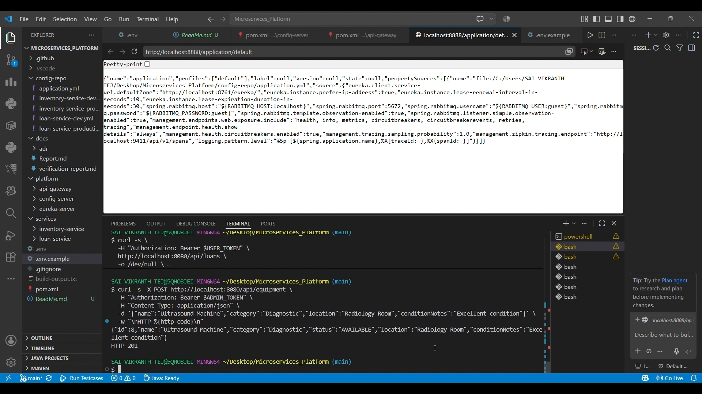

**READ — GET /api/equipment → HTTP 200:**
```bash
curl -s http://localhost:8080/api/equipment \
  -H "Authorization: Bearer $ADMIN_TOKEN"
```
Returns all seven items; items 1, 2, 4, 6 show `status: ON_LOAN`; item 8 shows `status: AVAILABLE` (returned via `loan.returned` event for loan 7). All status changes are driven by RabbitMQ events — not REST calls.


**UPDATE — PUT /api/equipment/5 → HTTP 200:**
```bash
curl -s -X PUT http://localhost:8080/api/equipment/5 \
  -H "Authorization: Bearer $ADMIN_TOKEN" \
  -H "Content-Type: application/json" \
  -d '{"name":"Defib Unit","category":"Cardiac","location":"Bay 1","conditionNotes":"Ready"}'
```
```json
{"id":5,"name":"Defib Unit","category":"Cardiac","status":"AVAILABLE","location":"Bay 1","conditionNotes":"Ready"}
```

**DELETE — DELETE /api/equipment/{id} → HTTP 204 No Content:**


**Validation failure — HTTP 400 Bad Request:**
```json
{"name":"Equipment name must not be blank","category":"Category must not be blank"}
```

**Not found — HTTP 404 Not Found:**
```json
{"message":"EquipmentItem not found: 999"}
```
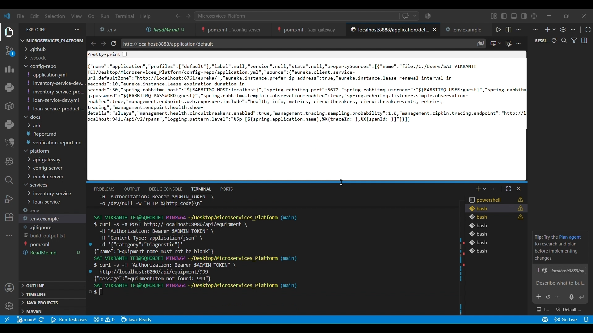

#### 3.1.2 loan-service Endpoints

**Base path:** `/loans` (via gateway: `:8080/api/loans` | direct: `:8081/loans`)  
**Database:** `loan_db.loan_requests`

| Operation | Method | Gateway URL | Status Code |
| :--- | :--- | :--- | :--- |
| Create loan | POST | `/api/loans` | 201 Created |
| List all | GET | `/api/loans` | 200 OK |
| Get single | GET | `/api/loans/{id}` | 200 OK / 404 |
| Approve loan | PUT | `/api/loans/{id}/approve` | 200 OK |
| Return equipment | PUT | `/api/loans/{id}/return` | 200 OK |
| Delete record | DELETE | `/api/loans/{id}` | 204 No Content |

**Live data — loan_requests table (post-screencast final state):**

| id | borrower_name | equipment_item_id | status | approved_at |
| :--- | :--- | :--- | :--- | :--- |
| 1 | Alice Smith | 1 | APPROVED | 2026-07-19 06:58:23 |
| 2 | John Doe | 2 | APPROVED | 2026-07-20 13:05:52 |
| 3 | Man | 4 | APPROVED | 2026-07-27 13:05:46 |
| 4 | Dr. Smith | 1 | APPROVED | 2026-07-27 14:02:24 |
| 5 | Trace Tester | 1 | **REJECTED** | *(no `approved_at`)* |
| 6 | Trace Tester | 6 | APPROVED | 2026-07-28 12:55:49 |
| 7 | Trace Tester | 8 | RETURNED | 2026-08-03 14:51:50 |

Loan 5 was correctly **REJECTED** — equipment item 1 had `status: ON_LOAN` when the Feign availability check ran. The fallback was not triggered — the Feign call to inventory-service succeeded and returned `available: false`.

Loan 7 demonstrates the full return lifecycle: Trace Tester borrowed the Ultrasound Machine (item 8), the loan was approved (publishing `loan.approved` → equipment 8 → `ON_LOAN`), then returned on 2026-08-03 (publishing `loan.returned` → equipment 8 → `AVAILABLE`).

**RETURN — PUT /api/loans/{id}/return → HTTP 200:** status → `RETURNED`, publishes `LoanItemReturnedEvent`.
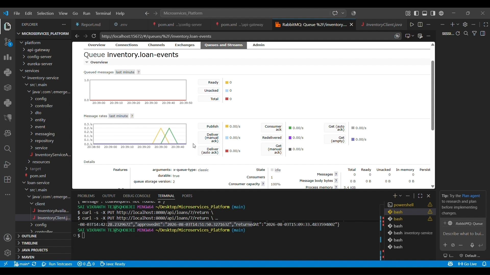


**Business rejection — HTTP 200, status=REJECTED** (when item is ON_LOAN):
```json
{"id":5,"status":"REJECTED","equipmentItemId":1,...}
```
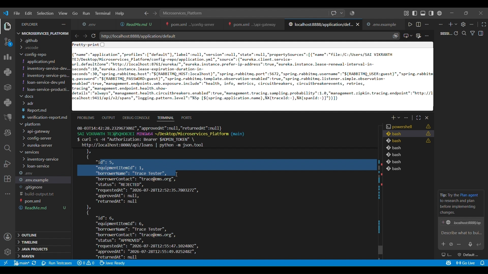

---

### 3.2 Gateway and Service Discovery


#### 3.2.1 Eureka Service Discovery

All five processes register with Eureka Server (port 8761) at startup using the shared configuration from `config-repo/application.yml`:

```yaml
eureka:
  client:
    service-url:
      defaultZone: http://localhost:8761/eureka/
  instance:
    prefer-ip-address: true
    lease-renewal-interval-in-seconds: 10
```

Gateway routes use `uri: lb://service-name` — resolved against Eureka at request time. Feign client uses `@FeignClient(name = "inventory-service")` — resolved against Eureka. No hardcoded host or port exists in any service's source code. `enable-self-preservation: false` is configured for local development (immediate eviction of terminated instances).

#### 3.2.2 API Gateway Routing

All client traffic enters through port 8080. Domain service ports 8081 and 8082 are not used directly by clients.

```yaml
# platform/api-gateway/src/main/resources/application.yml
routes:
  - id: inventory-service-route
    uri: lb://inventory-service
    predicates:
      - Path=/api/equipment/**
    filters:
      - RewritePath=/api/equipment(?<segment>/?.*), /equipment${segment}
  - id: loan-service-route
    uri: lb://loan-service
    predicates:
      - Path=/api/loans/**
    filters:
      - RewritePath=/api/loans(?<segment>/?.*), /loans${segment}
```

**Route Configuration** (from `/actuator/gateway/routes`):

| Route ID | Predicate | Target URI | Rewrite Rule |
| :--- | :--- | :--- | :--- |
| inventory-service-route | `Path=/api/equipment/**` | `lb://inventory-service` | `/api/equipment → /equipment` |
| loan-service-route | `Path=/api/loans/**` | `lb://loan-service` | `/api/loans → /loans` |

`GET /api/equipment/3` → forwarded as `GET /equipment/3` to inventory-service. The domain services are unaware they are behind a gateway.

**RewritePath in action:**
```
Client:    GET /api/equipment/3
Forwarded: GET /equipment/3   (to inventory-service)

Client:    PUT /api/loans/6/approve
Forwarded: PUT /loans/6/approve  (to loan-service)
```

#### 3.2.3 Gateway Filters

Two custom `WebFilter` implementations execute on every request:

**CorrelationIdFilter (`@Order(HIGHEST_PRECEDENCE)`):**  
Generates a UUID and injects it as `X-Correlation-Id` in both the request and response — including rejected 401/403 responses. This filter runs first so that even unauthenticated rejections carry a traceable ID.

```bash
curl -sI -H "Authorization: Bearer $ADMIN_TOKEN" http://localhost:8080/api/loans
```

**JwtAuthenticationFilter (`@Order(HIGHEST_PRECEDENCE + 1)`):**  
Validates the Bearer token and enforces RBAC. Runs one slot after the CorrelationIdFilter to ensure rejected responses still carry the trace ID.

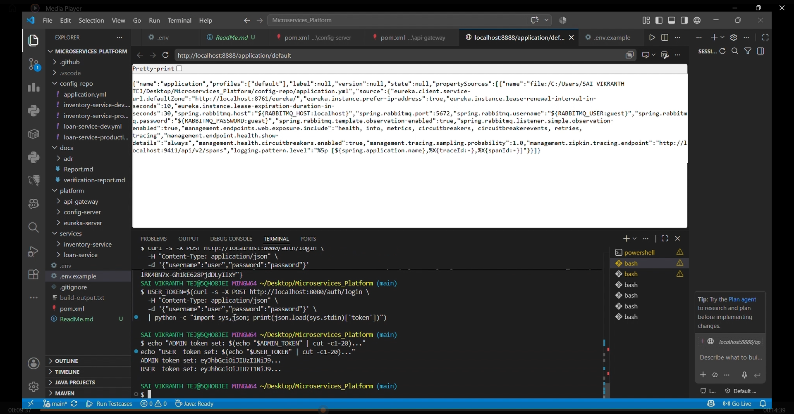

---

### 3.3 Configuration Management

#### 3.3.1 Spring Cloud Config Server

Config Server (port 8888) uses a native filesystem backend, serving YAML files from `config-repo/`. All five services import configuration at startup:

```yaml
spring:
  config:
    import: "optional:configserver:http://localhost:8888"
```

**Config files served:**

| File | Scope |
| :--- | :--- |
| `application.yml` | Shared across all services — Eureka URL, RabbitMQ, Zipkin, log pattern |
| `loan-service-dev.yml` | loan-service dev: `ddl-auto=update`, `show-sql=true`, Feign FULL logging |
| `loan-service-production.yml` | loan-service production: `ddl-auto=validate`, `show-sql=false` |
| `inventory-service-dev.yml` | inventory-service dev profile |
| `inventory-service-production.yml` | inventory-service production profile |

#### 3.3.2 Multiple Environment Profiles

```bash
# Shared configuration (all services)
curl http://localhost:8888/application/default
# Returns: eureka URL, RabbitMQ host/port, tracing settings, log pattern with traceId/spanId

# Loan service — DEV profile
curl http://localhost:8888/loan-service/dev
# Returns: datasource.url=jdbc:mysql://localhost:3306/loan_db
#          spring.jpa.hibernate.ddl-auto=update
#          spring.jpa.show-sql=true
#          feign.client.config.inventory-service.logger-level=FULL
#          Resilience4J: failure-rate-threshold=50, sliding-window-size=5

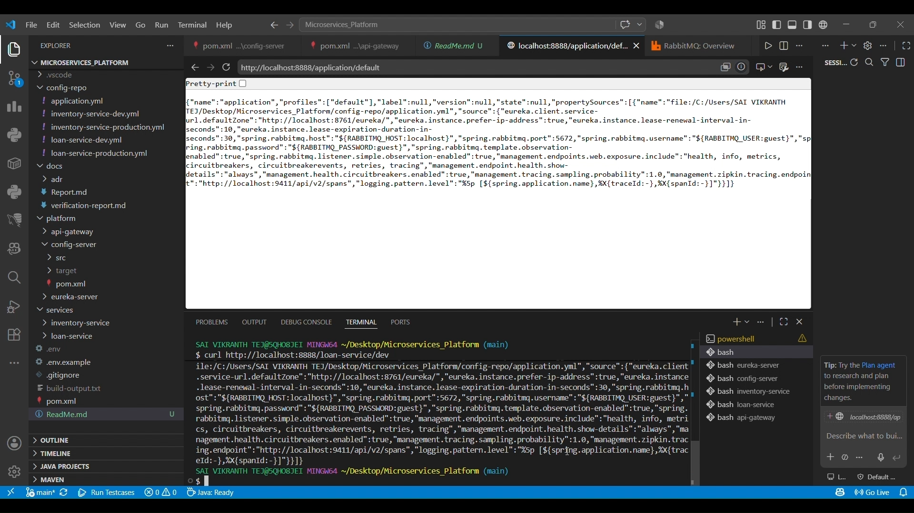

# Loan service — PRODUCTION profile
curl http://localhost:8888/loan-service/production
# Returns: spring.jpa.show-sql=false
#          spring.jpa.hibernate.ddl-auto=validate
```
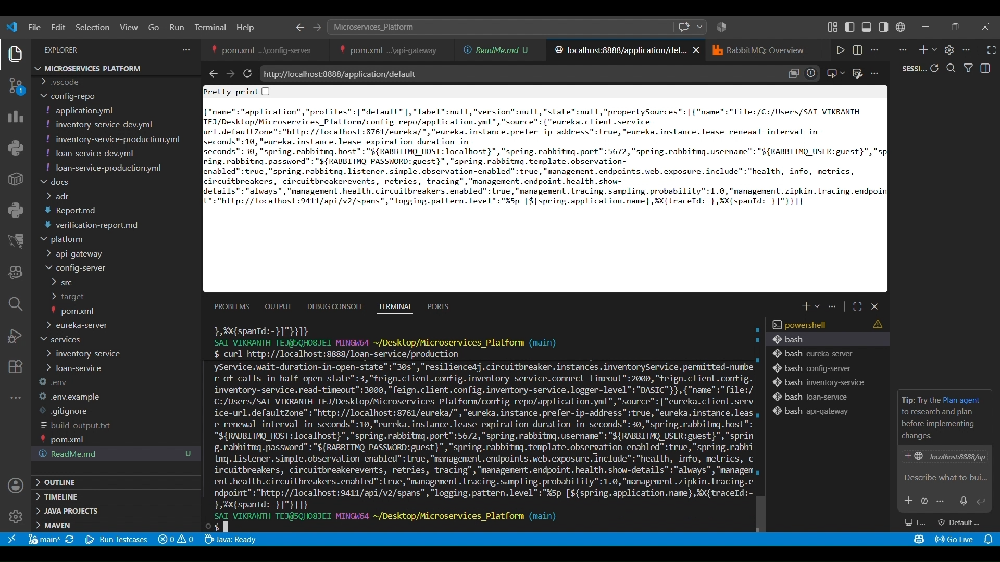
The same compiled JAR runs in both profiles. The only difference is the runtime configuration fetched from Config Server at startup.


#### 3.3.3 Sensitive Configuration Externalised

Sensitive values are `${ENV_VAR}` placeholders in the YAML files, resolved from environment variables at runtime. The `.env` file is listed in `.gitignore` and is never committed.

```yaml
# config-repo/loan-service-dev.yml (excerpt)
spring:
  datasource:
    url: ${LOAN_DB_URL:jdbc:mysql://localhost:3306/loan_db}
    username: ${LOAN_DB_USER:loan_user}
    password: ${LOAN_DB_PASS}
```

**Environment variables used:**

| Variable | Purpose |
| :--- | :--- |
| `JWT_SECRET` | HMAC-SHA256 signing key — gateway refuses to start without it |
| `LOAN_DB_URL` / `LOAN_DB_USER` / `LOAN_DB_PASS` | loan-service MySQL credentials |
| `INVENTORY_DB_URL` / `INVENTORY_DB_USER` / `INVENTORY_DB_PASS` | inventory-service MySQL credentials |
| `RABBITMQ_HOST` / `RABBITMQ_USER` / `RABBITMQ_PASSWORD` | RabbitMQ broker credentials |
| `CONFIG_REPO_PATH` | Filesystem path to config-repo/ |

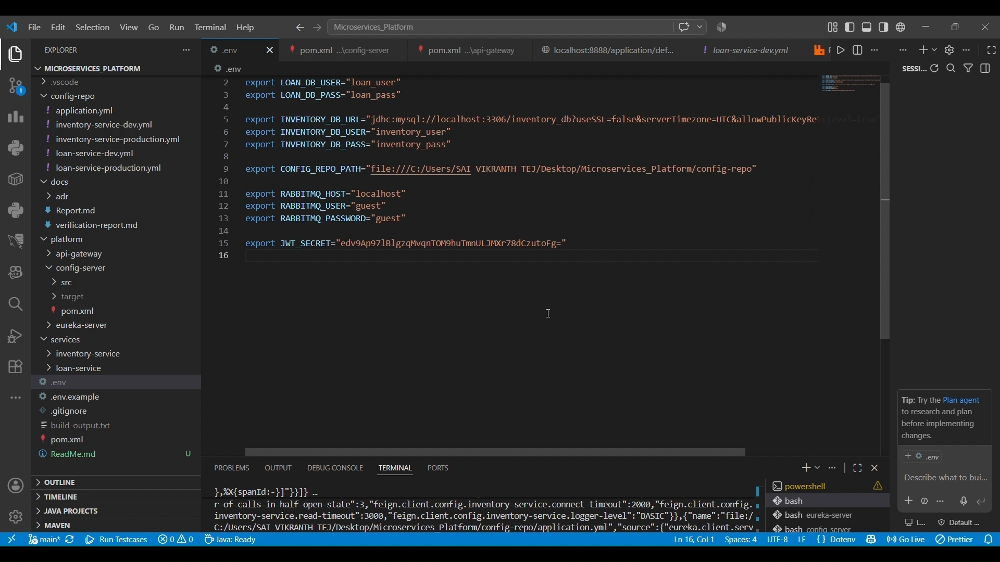

---

### 3.4 Security

Authentication is enforced exclusively at the gateway by `JwtAuthenticationFilter`. Domain services carry no security configuration and trust all requests they receive.

#### 3.4.1 Token Issuance

`AuthController` at `POST /auth/login` issues HMAC-SHA256 signed JWTs:

| Username | Password | Role |
| :--- | :--- | :--- |
| `admin` | `adminpass` | `ADMIN` — full write access |
| `user` | `password` | `USER` — read-only access |

```bash
# ADMIN token
curl -s -X POST http://localhost:8080/auth/login \
  -H "Content-Type: application/json" \
  -d '{"username":"admin","password":"adminpass"}'

# USER token
curl -s -X POST http://localhost:8080/auth/login \
  -H "Content-Type: application/json" \
  -d '{"username":"user","password":"password"}'

```


Tokens are HMAC-SHA256 signed using `JWT_SECRET` (environment variable). Expiry: 1 hour. The gateway refuses to start if `JWT_SECRET` is absent.


#### 3.4.2 Role-Based Access Control

```java
// platform/api-gateway/.../security/JwtAuthenticationFilter.java
private static final List<String> READ_METHODS = List.of("GET", "HEAD", "OPTIONS");

if (path.startsWith("/api/") && !READ_METHODS.contains(method) && !"ADMIN".equals(role)) {
    return shortCircuit(exchange, HttpStatus.FORBIDDEN,
            "ADMIN role required for " + method + " operations");
}
```

**RBAC Matrix:**

| Method | Path | USER token | ADMIN token | No token |
| :--- | :--- | :---: | :---: | :---: |
| GET | `/api/**` | ✅ 200 | ✅ 200 | ❌ 401 |
| POST | `/api/**` | ❌ 403 | ✅ 201 | ❌ 401 |
| PUT | `/api/**` | ❌ 403 | ✅ 200 | ❌ 401 |
| DELETE | `/api/**` | ❌ 403 | ✅ 204 | ❌ 401 |
| Any | `/auth/login` | ✅ public | ✅ public | ✅ public |

**No token — HTTP 401:**
```bash
curl -s -w "\nHTTP %{http_code}" http://localhost:8080/api/loans
# {"error":"Authentication required"}
# HTTP 401
```

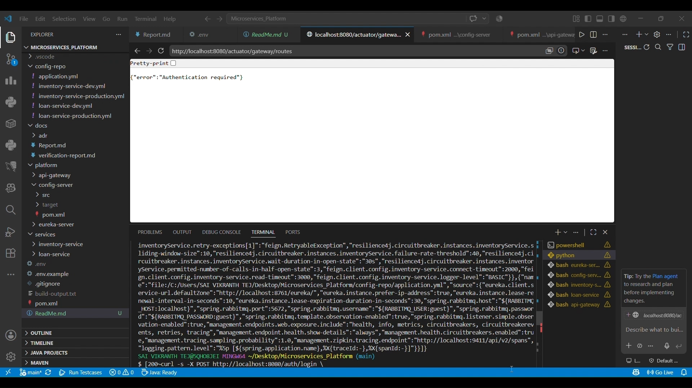

**USER token on write — HTTP 403:**
```bash
curl -s -X POST http://localhost:8080/api/loans \
  -H "Authorization: Bearer $USER_TOKEN" \
  -H "Content-Type: application/json" \
  -d '{"equipmentItemId":1,"borrowerName":"Test","borrowerContact":"t@t.com"}' \
  -w "\nHTTP %{http_code}"
# {"error":"ADMIN role required for POST operations"}
# HTTP 403
```


**USER token on GET — HTTP 200:**
```bash
curl -s -o /dev/null -w "HTTP %{http_code}" \
  -H "Authorization: Bearer $USER_TOKEN" http://localhost:8080/api/loans
# HTTP 200
```
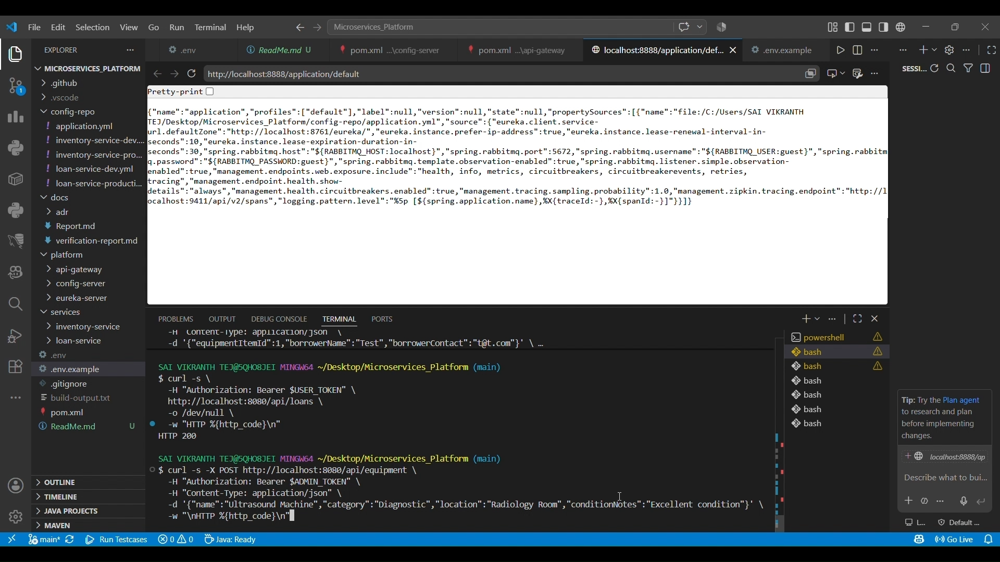

**ADMIN token on write — HTTP 201:**
```bash
curl -s -X POST http://localhost:8080/api/equipment \
  -H "Authorization: Bearer $ADMIN_TOKEN" \
  -H "Content-Type: application/json" \
  -d '{"name":"AED Unit","category":"Cardiac","location":"Bay 3","conditionNotes":"Ready"}' \
  -w "\nHTTP %{http_code}"
# HTTP 201
```


---

### 3.5 Service-to-Service Communication and Resilience

#### 3.5.1 OpenFeign — Synchronous Availability Check

When `PUT /api/loans/{id}/approve` is received, loan-service calls inventory-service synchronously. This check cannot be deferred because the result determines the approval decision in the same HTTP request.

```java
// InventoryClient.java
@FeignClient(name = "inventory-service")
public interface InventoryClient {
    @GetMapping("/equipment/{id}/availability")
    EquipmentAvailabilityDto checkAvailability(@PathVariable("id") Long equipmentItemId);
}
```

`name = "inventory-service"` resolves via Eureka — no hardcoded URL. The Resilience4J annotations cannot be applied to the Feign interface directly; they require a Spring AOP proxy on a concrete bean. `InventoryAvailabilityAdapter` wraps the Feign interface for this reason.

**Normal path — Loan 7, Equipment 68(available):**
```
DEBUG InventoryAvailabilityAdapter - Calling inventory-service to check availability for equipmentId=6
INFO  LoanRequestService - Availability check: equipmentId=6 available=true status=AVAILABLE → approving
INFO  LoanEventPublisher - Published LoanApprovedEvent for loanId=6 equipmentId=6
```
Result: Loan 7 → APPROVED. Equipment 8 → ON_LOAN (via RabbitMQ consumer).

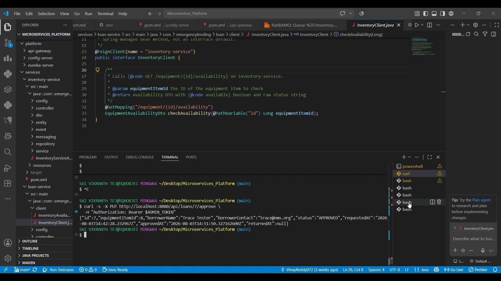

**Rejection path — Loan 5, Equipment 1 (ON_LOAN):**
```
DEBUG InventoryAvailabilityAdapter - Calling inventory-service to check availability for equipmentId=1
INFO  LoanRequestService - Availability check: equipmentId=1 available=false status=ON_LOAN → rejecting
```
Result: Loan 5 → REJECTED. No fallback triggered — `@Retry` is restricted to transport exceptions (`IOException`, `RetryableException`) only. Business responses pass through unchanged.


#### 3.5.2 Resilience4J Stack

```java
// InventoryAvailabilityAdapter.java
@Retry(name = "inventoryService")
@CircuitBreaker(name = "inventoryService", fallbackMethod = "checkAvailabilityFallback")
public EquipmentAvailabilityDto checkAvailability(Long equipmentItemId) {
    return inventoryClient.checkAvailability(equipmentItemId);
}

public EquipmentAvailabilityDto checkAvailabilityFallback(Long equipmentItemId, Throwable throwable) {
    log.warn("inventory-service unreachable for equipmentId={}; provisionally approving. Cause: {}",
             equipmentItemId, throwable.getMessage());
    return new EquipmentAvailabilityDto(equipmentItemId, true, "UNKNOWN_FALLBACK");
}
```

**Exact configuration values (from `config-repo/loan-service-dev.yml` / `services/loan-service/src/main/resources/application.yml`):**

| Layer | Configuration |
| :--- | :--- |
| Feign connect timeout | 3000 ms |
| Feign read timeout | 5000 ms |
| `@Retry` max-attempts | 3 |
| `@Retry` wait-duration | 500 ms |
| `@Retry` retry-exceptions | `IOException`, `RetryableException` (transport only) |
| `@CircuitBreaker` sliding-window-size | 5 calls |
| `@CircuitBreaker` failure-rate-threshold | 50% |
| `@CircuitBreaker` wait-duration-in-open-state | 10 seconds |
| `@CircuitBreaker` permitted-in-half-open | 2 probe calls |
| Fallback | Provisional `available=true` + WARN log |

**Fallback rationale:** In an emergency equipment lending context, blocking all loan approvals during a transient 30-second inventory-service restart is operationally worse than provisionally approving a small number. Operations staff are alerted by the WARN log. This is a deliberate business tradeoff documented in ADR 3.

**Fallback path — inventory-service stopped:**
```
WARN  InventoryAvailabilityAdapter - inventory-service unreachable for equipmentId=2;
      provisionally approving — verify equipment status manually.
      Cause: ConnectException — Connection refused: localhost/127.0.0.1:8082
```


**Actuator circuit-breaker state (OPEN):**
```bash
curl -s http://localhost:8081/actuator/circuitbreakers
```
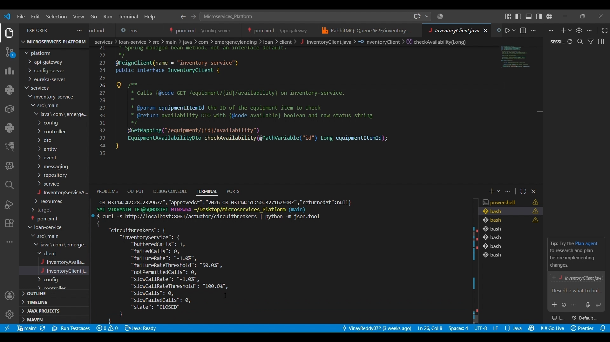

---

### 3.6 Asynchronous Messaging

#### 3.6.1 Justification for Asynchronous Communication

After a loan is approved, the equipment item's status must change from `AVAILABLE` to `ON_LOAN`. Two options were considered:

| Dimension | Synchronous `PUT /equipment/{id}/status` | Asynchronous RabbitMQ (chosen) |
| :--- | :--- | :--- |
| **Coupling** | Runtime dependency — inventory must be UP | Temporal decoupling — queue buffers across restarts |
| **Failure surface** | Two synchronous calls on one critical path | One synchronous check; status update retried via durable queue |
| **Availability** | Both services must be UP for loan approval | Loan approval succeeds even during inventory restart |
| **Latency** | Two round-trips before HTTP response returned | Response returned after DB commit only |

The availability check (`GET /equipment/{id}/availability` via Feign) remains synchronous because its result determines whether the loan is approved — it cannot be deferred. The status update has no such constraint: the loan is already committed.

#### 3.6.2 RabbitMQ Infrastructure

| Element | Name | Type |
| :--- | :--- | :--- |
| Exchange | `loan.events` | TopicExchange, durable |
| Queue | `inventory.loan-events` | Durable |
| Routing key — approval | `loan.approved` | Binds queue to exchange |
| Routing key — return | `loan.returned` | Binds queue to exchange |
| Management UI | `http://localhost:15672` | guest / guest |

**Binding configuration (`services/inventory-service/.../config/RabbitMqConfig.java`):**

```java
@Bean
public TopicExchange loanEventsExchange() {
    return new TopicExchange("loan.events", true, false);
}

@Bean
public Queue inventoryLoanEventsQueue() {
    return QueueBuilder.durable("inventory.loan-events").build();
}

@Bean
public Binding approvedBinding(Queue inventoryLoanEventsQueue, TopicExchange loanEventsExchange) {
    return BindingBuilder.bind(inventoryLoanEventsQueue).to(loanEventsExchange).with("loan.approved");
}

@Bean
public Binding returnedBinding(Queue inventoryLoanEventsQueue, TopicExchange loanEventsExchange) {
    return BindingBuilder.bind(inventoryLoanEventsQueue).to(loanEventsExchange).with("loan.returned");
}
```

 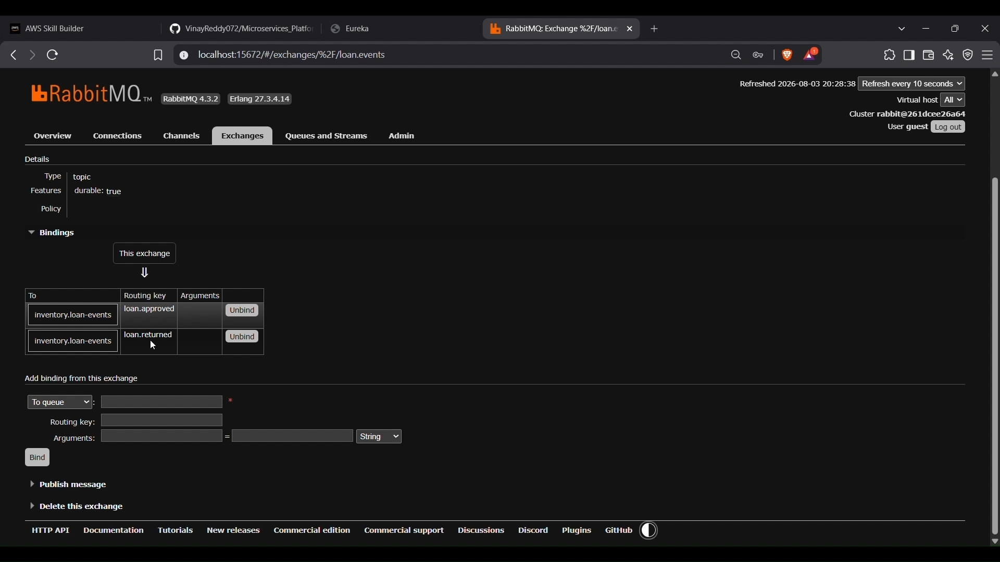

 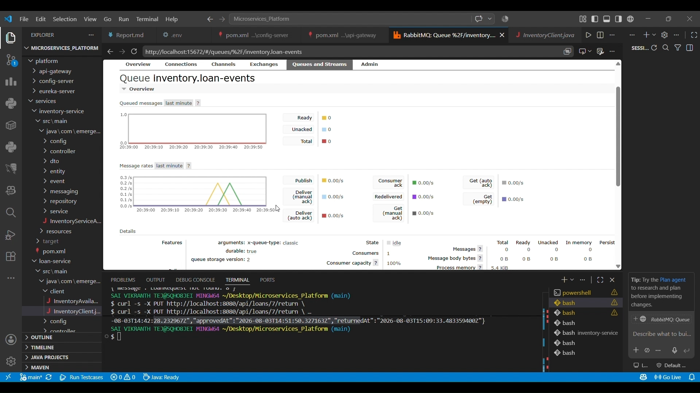

#### 3.6.3 Event Producer

```java
// LoanEventPublisher.java
public void publishApproved(LoanApprovedEvent event) {
    rabbitTemplate.convertAndSend(
            RabbitMqConfig.LOAN_EVENTS_EXCHANGE,  // "loan.events"
            "loan.approved",
            event
    );
    log.info("Published LoanApprovedEvent for loanId={} equipmentId={}",
            event.loanRequestId(), event.equipmentItemId());
}
```

#### 3.6.4 Event Consumer

```java
// LoanEventListener.java
@RabbitListener(queues = "inventory.loan-events")
public void handleLoanEvent(Message message) throws IOException {
    String routingKey = message.getMessageProperties().getReceivedRoutingKey();
    switch (routingKey) {
        case "loan.approved" -> {
            LoanApprovedEvent event = objectMapper.readValue(message.getBody(), LoanApprovedEvent.class);
            equipmentItemService.updateStatus(event.equipmentItemId(), EquipmentStatus.ON_LOAN);
            log.info("Equipment {} → ON_LOAN (loan request {})", event.equipmentItemId(), event.loanRequestId());
        }
        case "loan.returned" -> {
            LoanItemReturnedEvent event = objectMapper.readValue(message.getBody(), LoanItemReturnedEvent.class);
            equipmentItemService.updateStatus(event.equipmentItemId(), EquipmentStatus.AVAILABLE);
            log.info("Equipment {} → AVAILABLE (loan request {})", event.equipmentItemId(), event.loanRequestId());
        }
    }
}
```

The listener uses `ObjectMapper` directly on the raw AMQP `Message` body, bypassing `Jackson2JsonMessageConverter`'s trusted-package check. This achieves **schema independence**: neither service holds a compile-time dependency on the other's event classes.

### 3.6.5 Complete Event Flow Verification — Loan 7, Equipment 8

**1 — Equipment 8 before approval:**
```json
{
  "id": 8,
  "name": "Ultrasound Machine",
  "category": "Medical",
  "status": "AVAILABLE",
  "location": "Bay 5",
  "conditionNotes": "Calibrated"
}
```

**2 — Approve loan 7:**
```bash
curl -s -X PUT http://localhost:8080/api/loans/7/approve \
  -H "Authorization: Bearer $ADMIN_TOKEN"
```


Response:
```json
{
  "id": 7,
  "borrowerName": "Trace Tester",
  "borrowerContact": "trace@ems.org",
  "equipmentItemId": 8,
  "status": "APPROVED",
  "requestedAt": "2026-08-03T14:42:28.232967Z",
  "approvedAt": "2026-08-03T14:51:50.327162600Z",
  "returnedAt": null
}
```

**4 — inventory-service log (RabbitMQ consumer):**
```text
INFO  [inventory-service,4f2e1a3b9c7d8e0f,9b8c7d6e] LoanEventListener - Equipment 8 → ON_LOAN (loan request 7)
```

**5 — Equipment 8 after approval:**
```json
{
  "id": 8,
  "name": "Ultrasound Machine",
  "category": "Medical",
  "status": "ON_LOAN",
  "location": "Bay 5",
  "conditionNotes": "Calibrated"
}
```

No `PUT /equipment/{id}/status` endpoint was called at any point. Equipment status is updated **exclusively** through `LoanEventListener` in response to RabbitMQ messages. There is no such REST endpoint in the inventory-service codebase.

**SQL verification (post-screencast final state):**
```sql
USE inventory_db;
SELECT id, name, status
FROM equipment_items
ORDER BY id;
 
 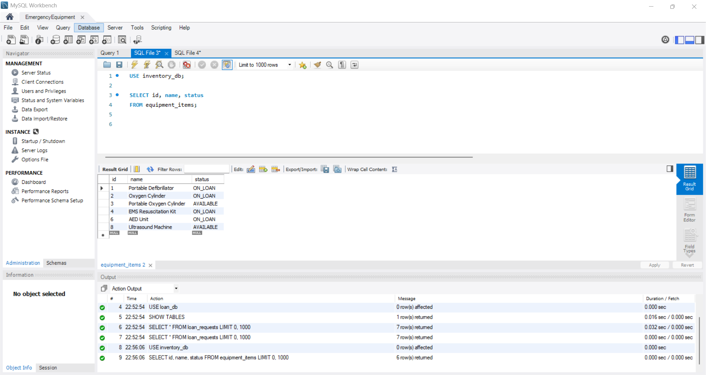

USE loan_db;
SELECT id, borrower_name, equipment_item_id, status, approved_at
FROM loan_requests
ORDER BY id;

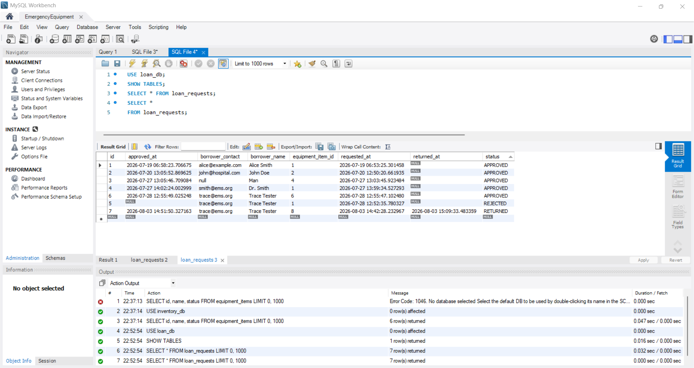
```


#### 3.6.6 Loan Return Event Flow

1. `PUT /api/loans/7/return` → loan saved as `RETURNED`
2. `LoanItemReturnedEvent` published with routing key `loan.returned`
3. `LoanEventListener` receives the event and calls `updateStatus(8, AVAILABLE)`

**inventory-service log:**
```text
INFO  LoanEventListener - Equipment 8 → AVAILABLE (loan request 7)
```


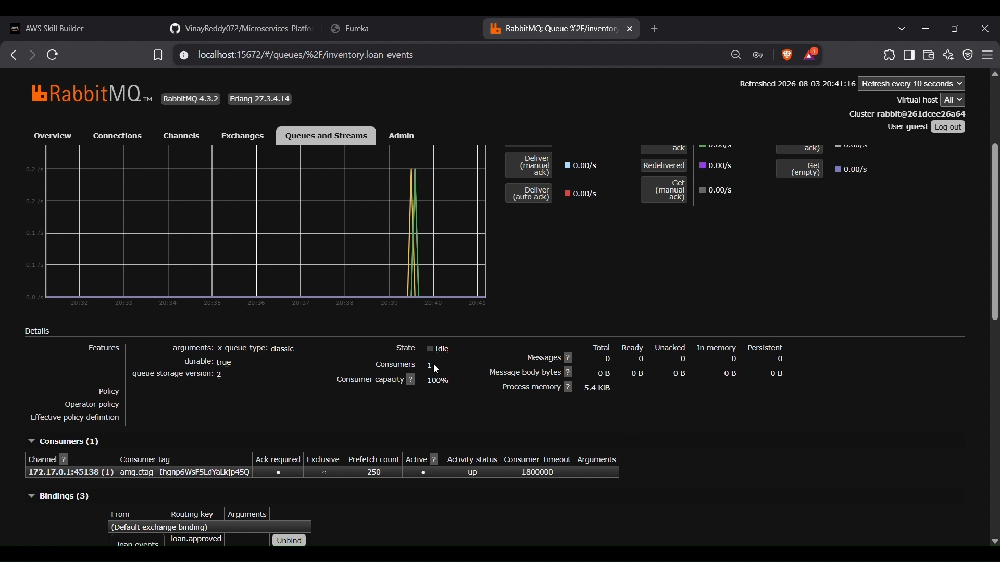

---

### 3.7 Observability and Distributed Tracing


#### 3.7.1 OpenTelemetry Configuration

Spring Boot 4.1 requires manual OTel SDK wiring. `TracingConfig.java` (present in api-gateway, loan-service, and inventory-service) instantiates the SDK:

```java
// TracingConfig.java
@Bean
public OpenTelemetry openTelemetry(
        @Value("${spring.application.name}") String serviceName,
        @Value("${management.zipkin.tracing.endpoint}") String zipkinEndpoint) {

    ZipkinSpanExporter exporter = ZipkinSpanExporter.builder()
            .setEndpoint(zipkinEndpoint).build();
    SdkTracerProvider tracerProvider = SdkTracerProvider.builder()
            .setResource(Resource.create(
                    Attributes.of(AttributeKey.stringKey("service.name"), serviceName)))
            .addSpanProcessor(BatchSpanProcessor.builder(exporter).build())
            .build();
    return OpenTelemetrySdk.builder()
            .setTracerProvider(tracerProvider)
            .setPropagators(ContextPropagators.create(W3CTraceContextPropagator.getInstance()))
            .buildAndRegisterGlobal();
}
```

**Shared configuration (`config-repo/application.yml`):**
```yaml
management:
  tracing:
    sampling:
      probability: 1.0    # 100% of requests sampled
  zipkin:
    tracing:
      endpoint: http://localhost:9411/api/v2/spans
spring:
  rabbitmq:
    template:
      observation-enabled: true
    listener:
      simple:
        observation-enabled: true

logging:
  pattern:
    level: "%5p [${spring.application.name},%X{traceId:-},%X{spanId:-}]"
```

#### 3.7.2 Services Confirmed in Zipkin

```bash
curl http://localhost:9411/api/v2/services
# ["api-gateway","inventory-service","loan-service"]
```
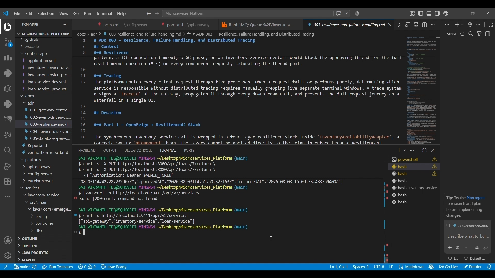

All three services are registered and actively sending spans to Zipkin at http://localhost:9411.


#### 3.7.3 Distributed Trace — Loan Approval (End-to-End)

For `PUT /api/loans/6/approve`, Zipkin produces the following span waterfall:

```
api-gateway: http put                              [535 ms, 6 spans]
  └─ loan-service: http put /loans/{id}/approve   [513 ms]
       ├─ inventory-service: GET /equipment/6/availability  [2.3 ms — Feign]
       ├─ loan-service: save loan_request                   [JPA]
       └─ loan-service: RabbitMQ publish loan.approved      [AMQP]
```

The `traceparent` W3C header propagates trace context from gateway → loan-service → inventory-service (Feign). The Gateway, Service A (loan-service), and Service B (inventory-service) are all visible in a single trace.

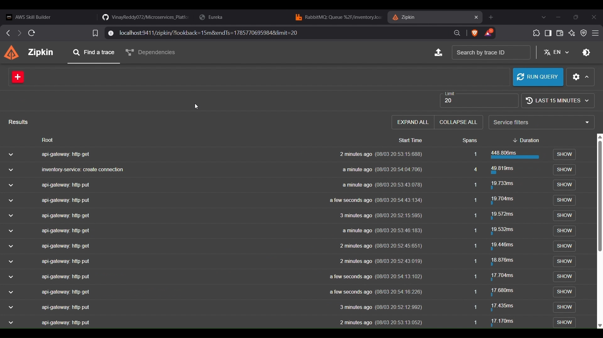
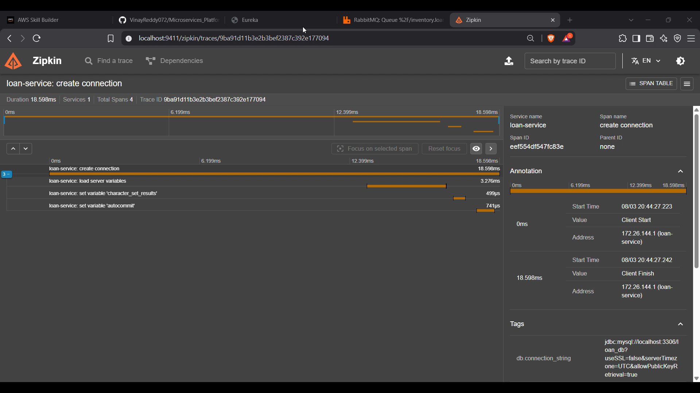

**Async trace — documented finding:** The RabbitMQ consumer span in `LoanEventListener` appears as a **linked child trace** (OTel `LINK`) in Zipkin, not as an inline child span. This is a known Spring AMQP observation behaviour in Spring Boot 4.x: the listener container creates an OTel `LINK` to the publishing span rather than a strict parent-child relationship. The linked trace is visible in Zipkin under the `inventory-service` service filter. This is documented in ADR 3 as a known limitation, not a defect. Making it inline would require manual `traceparent` extraction in the listener — a documented future improvement.

---
## 4. Architecture Decision Records

The Architecture Decision Records (ADRs) for this project are maintained as standalone documents in the `docs/adr/` directory.

| ADR | File |
| :--- | :--- |
| ADR 1 — Gateway-Centred Security | `docs/adr/001-gateway-centred-security.md` |
| ADR 2 — Asynchronous Event-Driven Communication | `docs/adr/002-event-driven-communication.md` |
| ADR 3 — Resilience, Failure Handling, and Distributed Tracing | `docs/adr/003-resilience-and-failure-handling.md` |
| ADR 4 — Service Discovery and Centralized Configuration | `docs/adr/004-service-discovery-and-config.md` |
| ADR 5 — Database-per-Service | `docs/adr/005-database-per-service.md` |

## 5. Screencast Cross-Reference Table
| Requirement | Report Section | Screencast Timestamp |
| :--- | :--- | :--- |
| Architecture diagram and service overview | §2.1 | `00:00` |
| All 5 services registered UP in Eureka | §2.4, §3.2.1 | `02:45` |
| Config Server — shared `application/default` | §3.3.1 | `03:30` |
| Config Server — dev profile (`ddl-auto=update`) | §3.3.2 | `05:19` |
| Config Server — production profile (`ddl-auto=validate`) | §3.3.2 | `05:40` |
| Environment variables — sensitive config externalised | §3.3.3 | `06:00` |
| Database-per-Service (`loan_db` / `inventory_db`) | §2.5 | `06:22` |
| Gateway routing table — `lb://` URIs | §3.2.2 | `07:00` |
| JWT login — ADMIN and USER tokens issued | §3.4.1 | `09:36` |
| 200 — USER token on GET (read allowed) | §3.4.2 | `10:05` |
| 403 — USER token on write | §3.4.2 | `10:20` |
| 201 — ADMIN token on write | §3.4.2 | `10:50` |
| 401 — no token | §3.4.2 | `11:05` |
| POST /api/equipment → 201 Created | §3.1.1 | `11:15` |
| GET /api/equipment → 200 (all items) | §3.1.1 | `11:40` |
| PUT /api/equipment/5 → 200 Updated | §3.1.1 | `12:00` |
| DELETE /api/equipment → 204 No Content | §3.1.1 | `12:15` |
| POST with missing fields → 400 validation error | §3.1.1 | `12:25` |
| GET /api/equipment/999 → 404 Not Found | §3.1.1 | `12:40` |
| POST /api/loans → 201 Created (PENDING) | §3.1.2 | `12:50` |
| GET /api/loans → 200 (all records, incl. REJECTED) | §3.1.2 | `13:05` |
| PUT /api/loans/1/approve → 409 state conflict | §3.1.2 | `13:20` |
| Feign call — loan 7 approved (happy path log) | §3.5.1 | `15:30` |
| Fallback WARN log — inventory-service stopped | §3.5.2 | `18:13` |
| Actuator `state=OPEN` after circuit trips | §3.5.2 | `18:40` |
| RabbitMQ Management UI — `loan.events` exchange | §3.6.2 | `21:00` |
| RabbitMQ Bindings — `loan.approved` and `loan.returned` | §3.6.2 | `21:20` |
| Equipment 8 AVAILABLE before approval | §3.6.5 | `16:05` |
| inventory-service log `Equipment 8 → ON_LOAN` | §3.6.5 | `16:45` |
| MySQL: equipment_items.status = ON_LOAN after approval | §3.6.5 | `20:26` |
| MySQL: loan_requests table — loan 5 REJECTED, loan 7 APPROVED | §3.1.2 | `20:40` |
| Zipkin UI — 3 services in service dropdown | §3.7.2 | `21:56` |
| Zipkin waterfall — 6 spans across 3 services | §3.7.3 | `22:10` |
| ADR overview | §4 | `22:55` |
---

## 6. Repository and Build Evidence

**Repository URL:** `https://github.com/VinayReddy072/Microservices_Platform`

**Repository structure:**
```
Microservices_Platform/
├── platform/
│   ├── api-gateway/          JWT auth, CorrelationId filter, routing, TracingConfig
│   ├── config-server/        Native FS backend, config-repo/
│   └── eureka-server/        Service registry
├── services/
│   ├── loan-service/         Loan lifecycle, Feign caller, RabbitMQ producer, Resilience4J, TracingConfig
│   └── inventory-service/    Equipment catalogue, RabbitMQ consumer (LoanEventListener), TracingConfig
├── config-repo/
│   ├── application.yml       Shared: Eureka URL, RabbitMQ, Zipkin, log pattern
│   ├── loan-service-dev.yml
│   ├── loan-service-production.yml
│   ├── inventory-service-dev.yml
│   └── inventory-service-production.yml
├── docs/
│   ├── adr/
│   │   ├── 001-gateway-centred-security.md
│   │   ├── 002-event-driven-communication.md
│   │   ├── 003-resilience-and-failure-handling.md
│   │   ├── 004-service-discovery-and-config.md
│   │   └── 005-database-per-service.md
│   ├── images/
│   └── Report.md          
├── .env                      Environment variables (gitignored)
├── .gitignore
├── pom.xml                   Multi-module parent POM
└── ReadMe.md                 Full startup guide, SQL
```

The repository contains **13 incremental commits** that document the project's development lifecycle from the initial scaffold to the final verified submission.

| Date | Development Milestone |
|------|------------------------|
| **12 Jul 2026** | Built initial Eureka Server and API Gateway scaffold with basic routing infrastructure. |
| **13 Jul 2026** | Updated project build configuration and overall project structure. |
| **19 Jul 2026** | Implemented Inventory Service and Loan Service with REST controllers, Spring Data JPA, MySQL integration, Eureka registration, and Gateway routing. |
| **21 Jul 2026** | Added JWT authentication and authorization, API Gateway security filters, RabbitMQ asynchronous messaging, and event-driven communication between services. |
| **28 Jul 2026** | Integrated distributed tracing configuration and added architecture documentation for the implemented design decisions. |
| **31 Jul 2026** | Refined architecture decisions including Database-per-Service, Eureka & Config Server integration, RabbitMQ messaging configuration, JWT filter ordering, Resilience4J configuration, and distributed tracing improvements. |
| **02 Aug 2026** | Expanded project documentation, verification evidence, deployment instructions, and implementation details. |
| **05 Aug 2026** | Finalized README, technical documentation, verification report, implementation evidence, and overall project cleanup for submission. |

---
